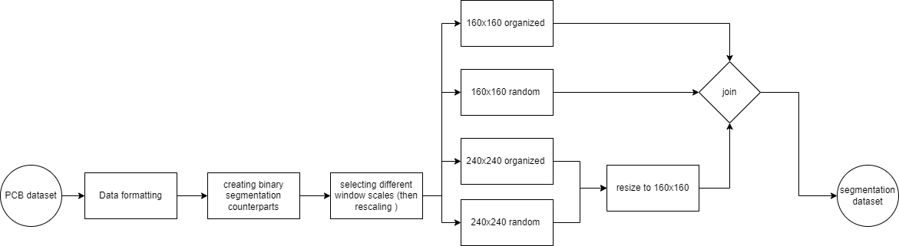

# PCB component detection and classification
In this project I tried implementing a solution to detect some of the common components in a Printed Circuit Board.  
For the detection, I built a U-net model to segment the image into component or background, I've also created a dataset for that purpose and augmented it.  
For the classification, I built a CNN to simply classify cropped sections whilst paying attention to the data imbalance. 
Fusing these 2 models will give us a RCNN inspired methods for components detections in PCBs. 

I've used Keras/TensorFlow and other CV libs for this project.

### Data source

I am using a dataset that I found with this [paper](https://arxiv.org/abs/1811.06994)

## Binary Segmentation

### Data preprocessing and generation

this is the pipeline I used for preprocessing and building the dataset for segmentation

### Results

after training the model I got these results 

this is the training and validation loss curves

## Classification

these were the plots for the classification results

